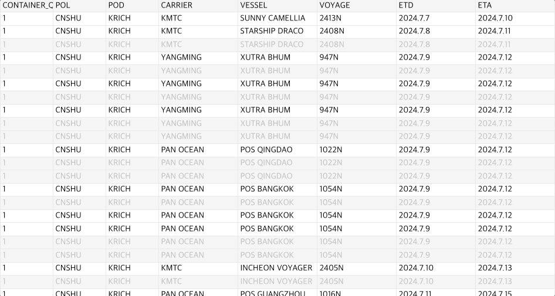

# Portlogics-grid &middot; [](https://github.com/portlogics-dev/portlogics-grid/blob/main/LICENSE) [](https://www.npmjs.com/package/portlogics-grid)

Portlogics-grid는 [@silevis/reactgrid](https://github.com/silevis/reactgrid)에 영감을 받아 트리 구조의 데이터를 좀 더 잘 표현할 수 있게 감싼 커스텀 라이브러리입니다.

[English](https://github.com/portlogics-dev/portlogics-grid/blob/main/README.md) | 한국어

# Docs

- [Demo](https://portlogics-grid.vercel.app/)

이 라이브러리의 거의 모든 개념은 [@silevis/reactgrid](https://github.com/silevis/reactgrid)와 동일합니다. 

- [Get Started](https://reactgrid.com/docs/4.0/1-getting-started/?utm_source=github&utm_medium=readme)
- [Documentation](https://reactgrid.com/docs/4.0/0-introduction/?utm_source=github&utm_medium=readme)
- [API Reference](https://reactgrid.com/docs/4.0/7-api/?utm_source=github&utm_medium=readme)

# 추가된 개념

트리-뷰 그리드를 표현하고 다루기 위해선, Portlogics-grid만의 추가적인 프로퍼티를 활용해야 해요.

## `enableGroupSelection` 프로퍼티

기본적인 row, column 그리고 range selection 기능은 기존의 것과 다르지 않습니다. 이 라이브러리에서는 group selection이라는 추가적인 기능을 통해 사용자에게 더 나은 직관성을 제공할 수 있어요.

`enableGroupSelection` 프로퍼티가 동작하는 방식은 기존의 `enableRowSelection`와 비슷합니다. 하지만 몇가지 추가적인 조치가 필요합니다.

첫번째로, `enableGroupSelection` 프로퍼티를 ReactGrid 컴포넌트에서 활성화해주세요.

``` tsx
<ReactGrid
  {...props}
  enableRowSelection
  enableColumnSelection
  enableGroupSelection
/>
```

두번째로, ReactGrid 컴포넌트에 주입할 `rows` 데이터에 `groupId` 프로퍼티를 삽입해주세요. 이때 `groupId`는 [기존의 `Cell` 인터페이스의 그것](https://reactgrid.com/docs/4.0/2-implementing-core-features/5a-groupId/)과는 다른 `Row` 인터페이스에서 추가된 프로퍼티입니다.

``` ts
export interface Row<TCell extends Cell = DefaultCellTypes> {
  /** Unique `Id` in all rows array */
  readonly rowId: Id;
  /** Array of `Cell` objects */
  readonly cells: TCell[];
  /** Height of each grid row (in default set to `25` in px) */
  readonly height?: number;
  /**
   * Property that allows row to change is position in grid,
   * default: `false` (row reorder implementation is on the developer's side)
   */
  readonly reorderable?: boolean;
  /**
   * Property when you want to enable grouped selection on your grid.
   * you should provide the same groupId to multiple rows if you want to group and focus them together.
   */
  readonly groupId?: number;
}
```

Portlogics-grid에 맞게 가공한 데이터는 아래와 같아야 합니다:

```json
[
    {
        "rowId": "header", // 헤더 행
        "cells": [
            {
                "type": "header",
                "text": "ColumnA"
            },
            {
                "type": "header",
                "text": "ColumnB"
            },
            {
                "type": "header",
                "text": "ColumnC"
            },
        ],
    },
    {
        "rowId": 0,
        "groupId": 0,
        "cells": [
            {
                "type": "text",
                "text": "A1"
            },
            {
                "type": "text",
                "text": "B1"
            },
            {
                "type": "text",
                "text": "C1"
            },
        ],
    },
    {
        "rowId": 1,
        "groupId": 0, // 이전 행과 같은 groupId를 가지고 있음으로써 사용자에게는 맨처음 행만 접근할 수 있도록 렌더됩니다.
        "cells": [
            {
                "type": "text",
                "text": "A1"
            },
            {
                "type": "text",
                "text": "B1"
            },
            {
                "type": "text",
                "text": "C2"
            },
        ],
    },
    {
        "rowId": 2,
        "groupId": 0,
        "cells": [
            {
                "type": "text",
                "text": "A1"
            },
            {
                "type": "text",
                "text": "B1"
            },
            {
                "type": "text",
                "text": "C3"
            },
        ],
    },
]
```

또한 위 예시와 같이 같은 groupId를 가지고 있는 복수의 `Row` 오브젝트들이 있다면, 같은 그룹 내 어떤 셀을 클릭해도 그림과 같이 해당 그룹 전체가 포커싱됩니다.



